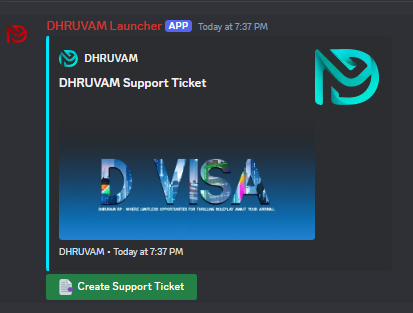
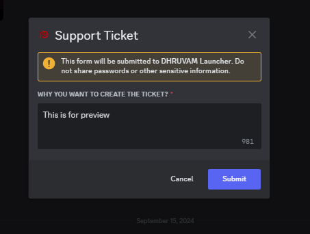
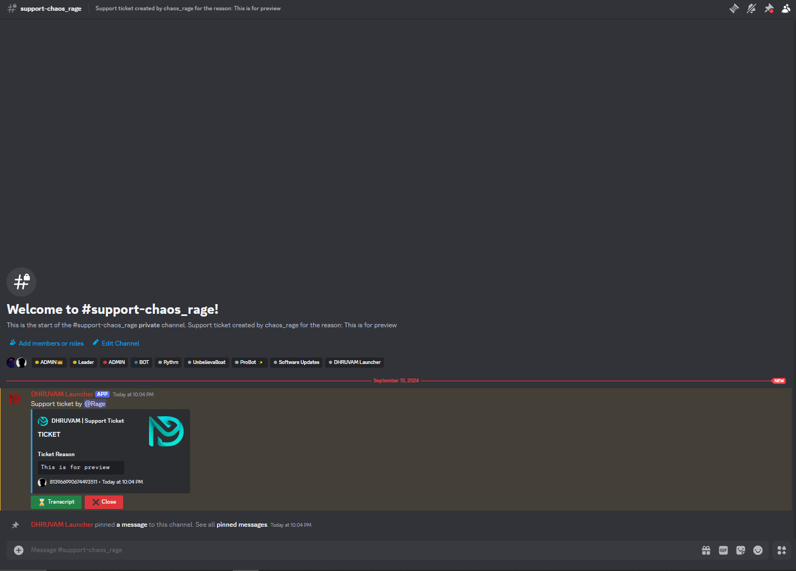

# Discord Ticket Bot
 
 This bot allows server members to create support tickets with a reason, and admins can manage the tickets efficiently. Admins can also generate a transcript of the ticket for record-keeping.

## Features:
**1. Create Tickets:** Users can create a ticket with a specified reason, which will be sent to the admins for review.

**2. Ticket Transcripts:** Admins can take a transcript of the ticket for documentation purposes.

## Getting Started
### Prerequisites

 - Node.js
 - PM2 (Process Manager)

### Installation
**1. Clone the repository:** Clone the repository to your local machine and navigate to the repository directory.

**2. Rename the example environment file: Rename `example.env` to `.env`.**

**3. Add your Discord bot token and other necessary information to the `.env` file:**
```
TOKEN = your_discord_bot_token
ClientID = your_admin_channel_id
GuildID = your_guild_id
```
**4. Install dependencies:** Run `npm install` to install all necessary packages.

### Starting the Bot
#### Start the bot using the following command:

```
node start.js
```

## Managing the Bot with PM2

- **View processes:**
    ``` bash
    pm2 list
    ```
- **Restart your bot:**
    ```bash
    pm2 restart bot
    ```

- **Stop your application:**
    ```bash
    pm2 stop bot
    ```

- **Monitor logs:**
    ```bash
    pm2 logs bot
    ```

## Initial Setup

Use the /setupticket command for the initial setup.

## Commands
- **/setupticket:** Configures the ticketing system.

## Screenshots







## Troubleshooting
- Bot not starting:
    - Make sure `example.env` has been renamed to `.env`.
    - Ensure the bot token is added correctly in `.env`.
    - Run `npm install` to ensure all dependencies are installed.

- Commands not working:

    - Verify that the bot has the required permissions.
    - Check if the bot is online and connected to the correct server.

## License

**This project is licensed under the LGPL License. See the [LICENCE](https://github.com/Rage-Gaming/Discord-ticket-bot/blob/main/LICENSE). file for details.**

## Support
**If you have any questions or need help, feel free to contact me on Discord: [Join Now](https://discord.gg/bDaYd2P9Vu).**